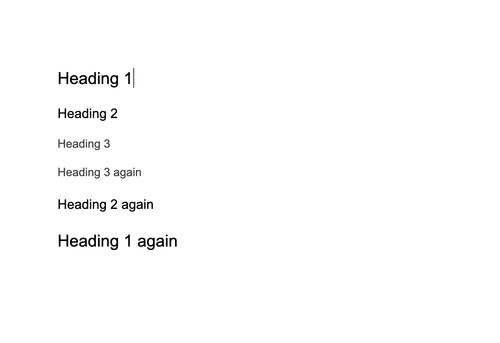
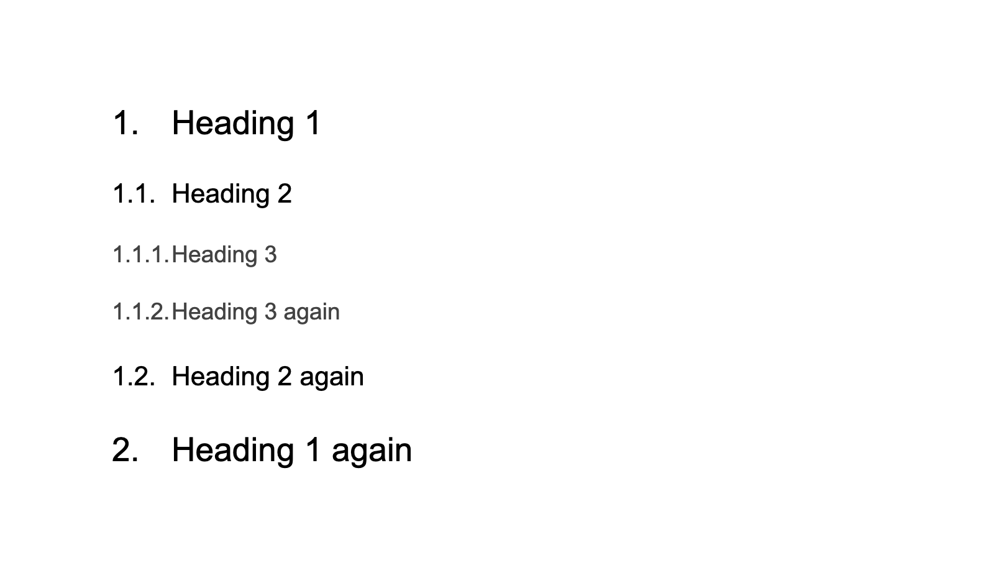
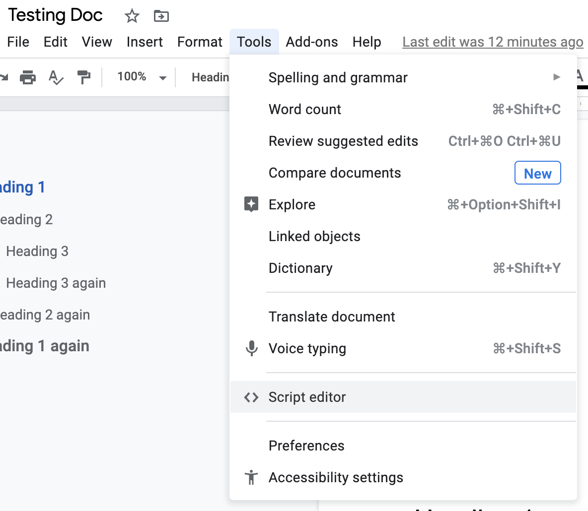
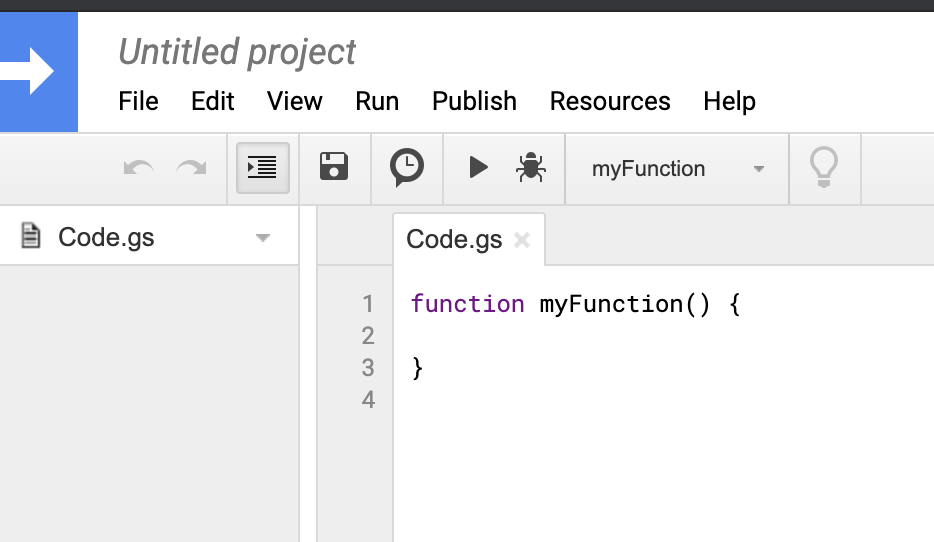
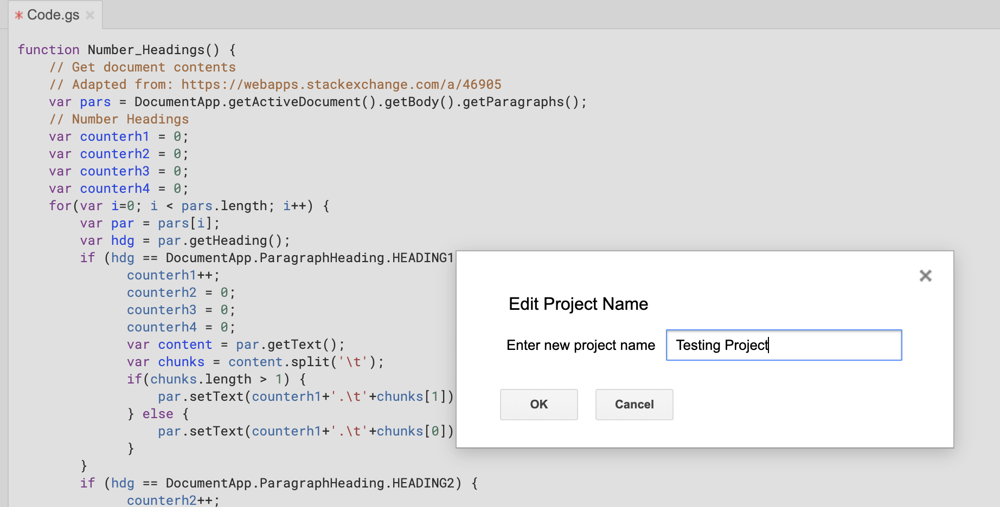
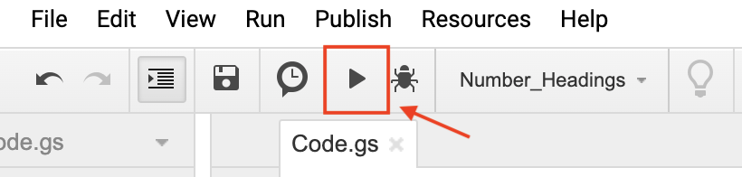
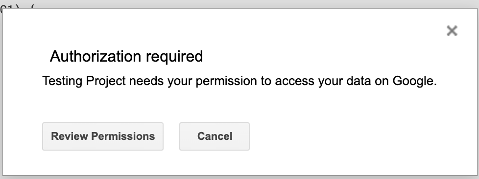
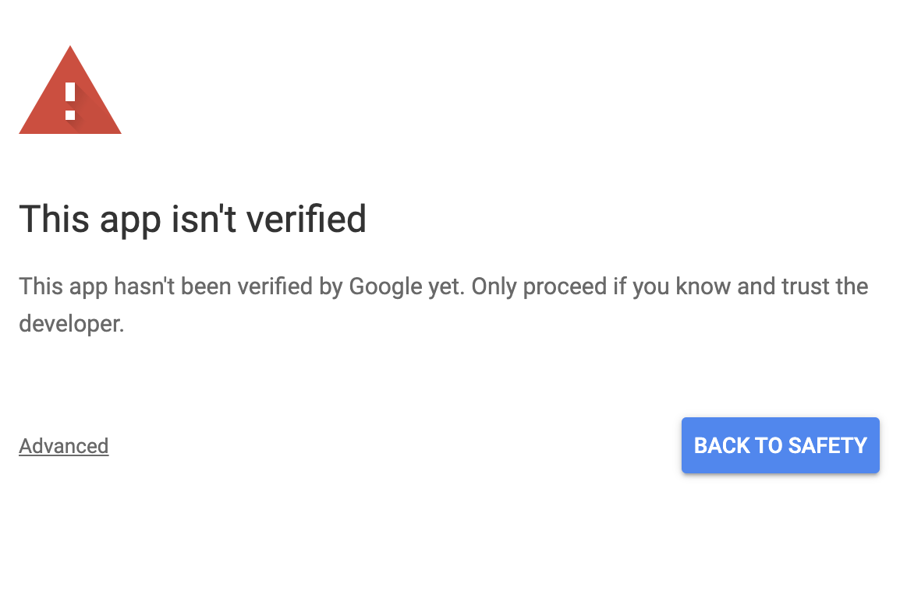
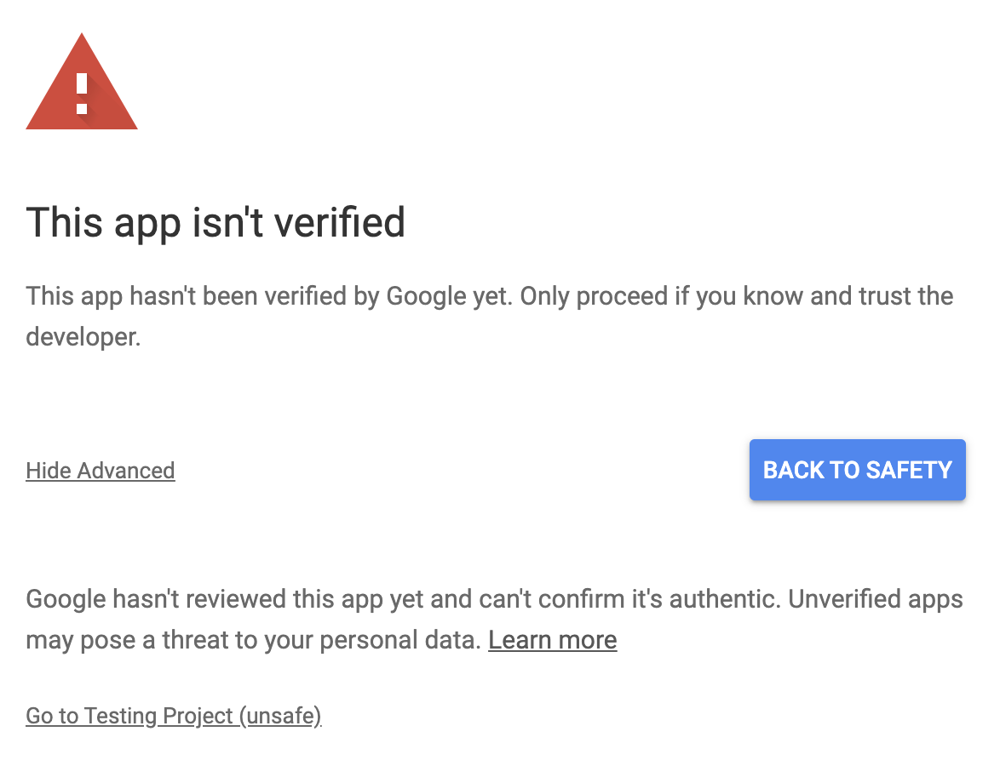

# google_scripts
Place to store google app scripts

# Google Docs - Numbered Headings

Disclaimer: These are scripts I created for my personal use. I am not responsible for any unintended side effects. I am using this for my current documents, and have not experienced any issues so far.

*Adapted from: https://webapps.stackexchange.com/a/46905*

Manual process. After adding new headings we will have to rerun the script to apply the numbered headings.

Before: 

After:

## Setup Guide
To use the numbered headings script just follow these steps.

Within the google doc go to tools -> script editor.

This will open a new window that looks like this:

Now delete that empty function text, copy and paste the script from [here](./google_docs/numbered_headings.gs) into that new window.

**NOTE: Please review the code you are copying. It should be simple to follow and I have also added comments to make this a bit easier. Always review someone else's code before using it on your own documents/data.**

Save it, which will prompt you to create a new project if you haven't done this before. Name it and click ok

Now we will click the run button which will give us another prompt related to this new project.

It will ask if you want to give your new project permission to access your data on google.
In order to continue press Review Permissions.

You will be asked to then sign in. This is to verify that you are able to give access to your documents.

After you sign in you will get a screen that looks like this:

This is because we just created this project, and therefore it has not been verified by google. This is asking us to confirm trusting our new test project. Now normally if you wrote the code yourself you would probably go ahead and trust yourself. Since you are following this guide and in effect trusting my code, you should review it yourself just in case. Otherwise you can try and find something on the add-ons marketplace if you do not feel comfortable proceeding.

Click the `Advanced` text to get the following option.

We then click `Go to <Name of your project> (unsafe)` and we should see the list of permissions. It should only show access to google docs.

If you are still comfortable with allowing this script access, click allow.

Now it should have applied the numbered headings to the document.

This is still a manual process however. After adding new headings we will have to go back here and click the run button again to apply the numbered headings.
